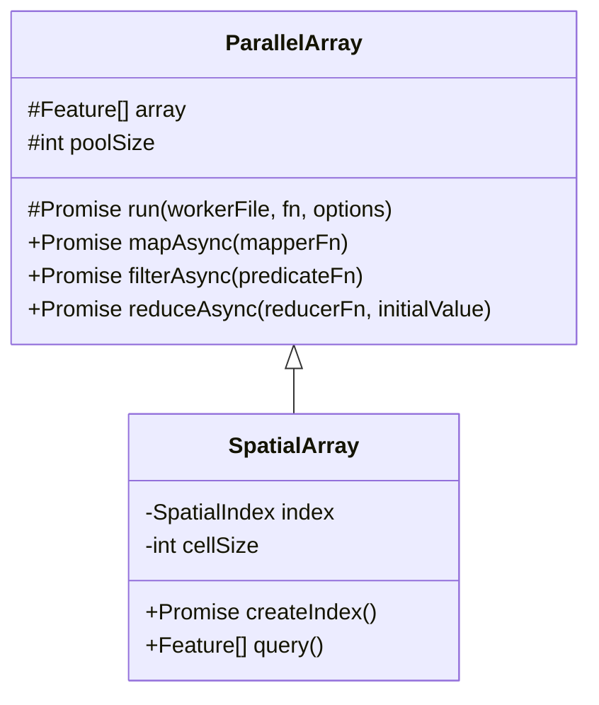

# Тестовое задание

## Требования к установленному ПО

- Node JS > 20
- yarn 4.17.0
- Для отправки запросов используется [cURL](https://curl.se/)

## Установка

Сборка:

```
yarn
yarn build
```

Генерация тестовых данных:

```
yarn data
```

Запуск сервера:

```
yarn serve
```

## Работа с сервером

Загрузка и индексация

```
curl -F "file_field_name=@data.bin" http://localhost:3000/load
```

Пространственный запрос

```
curl "http://localhost:3000/load/query?minLon=20&minLat=50&maxLon=130&maxLat=60"
```

## Программный интерфейс

Реализованы следующие классы:



## Замечания по реализации

По умолчанию размер рабочего пула устанавливается равным числу ядер процессора, шаг сетки равен единице.

Данные перед отправкой упаковываются в [Protocol Buffers](https://protobuf.dev/) и сохраняются в файл.

Так как функции передаются в Worker через строку, действуют следующие ограничения:

1. Нельзя использовать данные, попадающие в контекст функции из замыкания
2. Нельзя использовать ссылки на импортируемые глобальные объекты, включая функции и объекты доступные через this

Операция reduce может быть выполнена параллельно только для ассоциативных функций. Поэтому, передаваемая в параметр метода reduceAsync функция должна удовлетворять свойству ассоциативности, например быть аддитивного типа - сложение, умножение, конкатенация строк и т.д.
